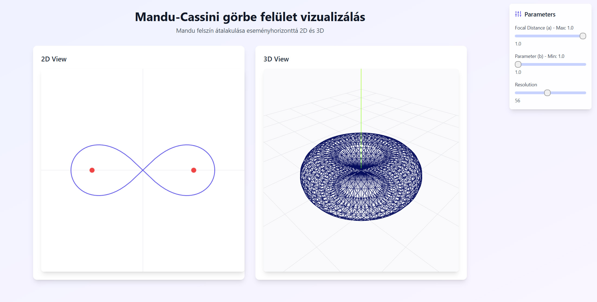

# 3D Cassini Curves Visualizer

An interactive web application for visualizing Cassini curves in both 2D and 3D, built with React, Three.js, and TypeScript.

[Magyar verzió lejjebb található](#3d-cassini-görbe-vizualizáló)



Demo: https://monumental-manatee-aa4a2e.netlify.app/

## Features

- Interactive 3D visualization of Cassini curves
- Real-time parameter adjustment
- 2D curve representation
- Smooth camera controls
- Modern, responsive user interface

## Technologies Used

- React 18
- Three.js
- React Three Fiber
- TypeScript
- Vite
- Tailwind CSS

## Getting Started

### Prerequisites

- Node.js (LTS version recommended)
- npm (comes with Node.js)

### Installation

1. Clone the repository:
```bash
git clone https://github.com/TTomas65/3D-Cassini-Curves-Visualizer.git
```

2. Navigate to the project directory:
```bash
cd 3D-Cassini-Curves-Visualizer
```

3. Install dependencies:
```bash
npm install
```

### Running the Application

To start the development server:
```bash
npm run dev
```

The application will be available at `http://localhost:5173`

### Building for Production

To create a production build:
```bash
npm run build
```

## Usage

1. Adjust the parameters using the control panel
2. Observe the changes in both 2D and 3D visualizations
3. Use mouse controls to rotate and zoom the 3D view

## License

This project is open source and available under the MIT License.

---

# 3D Cassini Görbe Vizualizáló

Egy interaktív webalkalmazás Cassini-görbék 2D és 3D megjelenítéséhez, React, Three.js és TypeScript technológiákkal megvalósítva.

## Jellemzők

- Cassini-görbék interaktív 3D vizualizációja
- Valós idejű paraméter módosítás
- 2D görbe reprezentáció
- Könnyen kezelhető kamera vezérlés
- Modern, reszponzív felhasználói felület

## Használt Technológiák

- React 18
- Three.js
- React Three Fiber
- TypeScript
- Vite
- Tailwind CSS

## Kezdeti Lépések

### Előfeltételek

- Node.js (LTS verzió ajánlott)
- npm (Node.js-sel együtt települ)

### Telepítés

1. Klónozza a repository-t:
```bash
git clone https://github.com/TTomas65/3D-Cassini-Curves-Visualizer.git
```

2. Navigáljon a projekt könyvtárába:
```bash
cd 3D-Cassini-Curves-Visualizer
```

3. Telepítse a függőségeket:
```bash
npm install
```

### Az Alkalmazás Futtatása

A fejlesztői szerver indításához:
```bash
npm run dev
```

Az alkalmazás elérhető lesz a `http://localhost:5173` címen

### Éles Verzió Készítése

Éles verzió építéséhez:
```bash
npm run build
```

## Használat

1. Állítsa be a paramétereket a vezérlőpanelen
2. Figyelje meg a változásokat mind a 2D, mind a 3D vizualizációban
3. Használja az egeret a 3D nézet forgatásához és nagyításához

## Licenc

Ez a projekt nyílt forráskódú és elérhető MIT Licenc alatt.
